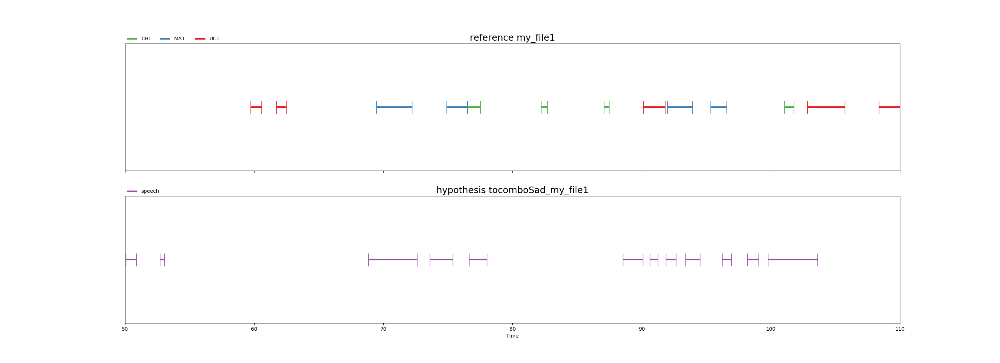

# Using DiViMe

## Overview

This is an overview of the full tool presentation found in the next sextion, recapping the main steps:

1. Put your data in the ```data``` shared directory.
2. Do `$ vagrant up` to "wake the machine up"

Next we provide instructions for all tools. More detailed information about each tool can be found in separate ReadMe files.

Assuming the installation of the virtual machine is complete and some of the tests have passed, you can now use at least some of the tools in the virtual machine. We explain more about each step below, but in a nutshell, the steps to use DiViMe are always the same:

1. Put the data you want to process in the ```data/``` directory (or any subdirectory within ```data/```)
2. Go to the DiViMe folder 
3. Do `$ vagrant up` to "wake the machine up"
4. Use tools on data, typically by doing `vagrant ssh -c "script.sh [arguments]"`. You can also run a recipe. 
5. Finally, remember to put DiViMe back to sleep with `$ vagrant halt`

## An example use case: analyzing .wav files using the full pipeline of current tools

1. Put the data you want to process in ```data/mydata/``` under the DiViMe main directory. Create a folder if it does not exist.
2. Make sure DiViMe is running (`vagrant up`)
3. Run `vagrant ssh -c "analyze.sh data/mydata/"`
4. Check ```data/mydata/``` for ELAN-readable .rttm files that contain full tool outputs (currently: speech detection & role diarization, vocal maturity classification, and syllable count estimation").


## Further information on Step 1, putting your data into the ```data/``` directory

Put the sound files that you want analyzed (and annotations, if you have any) inside the shared ```data``` folder. It is probably safer to make a copy of your files (rather than moving them), in case you later decide to delete the whole folder. Also, for greater security, DiViMe (as a VM) can only see data within the ```DiViMe``` folder, so soft links to files outside of that fodler will not work.

You can drop a whole folder into ```data```. You will provide the path to the specific folder to be analyzed when running the tools (as per instructions below). All `.wav` files in that folder will be analyzed. 

If your files aren't .wav some of the tools may not work. Please consider converting them into wav with some other program, such as [ffmpeg](https://www.ffmpeg.org/). It is probably safer to make a copy (rather than moving your files into the data folder), in case you later decide to delete the whole folder. 

If you have any annotations, put them also in the same ```data``` folder. Annotations must be in .rttm format, and *they should be named exactly as your wav files*. If you have annotations in .cha, .eaf, .textgrid, or .its, see the Format section for instructions on converting them into .rttm. 

IMPORTANT: If you already analyzed a file with a given tool, re-running the tool will result in the previous analysis being overwritten.

## Further information on Step 2, going to the DiViMe folder

To interact with the virtual machine, you must use a terminal. If you don't know what this means, we recommend that you first follow the [Software Carpentry Shell Tutorial](https://swcarpentry.github.io/shell-novice/) (up to 00:45, namely "Introducing the shell", and "Navigating files and directories"). 

Next, navigate in the terminal window to the DiViMe directory that was created when you did `git clone https://github.com/srvk/DiViMe` when installing DiViMe.

## Further information on Step 3, Waking the machine up

Remember that you will be using a mini-computer within your computer. Typically, the machine will be down - i.e., it will not be running. This is good, because when it is running, it will use memory and other resources from your computer (which we call "the host", because it is hosting the other computer). With this step, you launch the virtual machine:

`$ vagrant up`

## Further information on Step 4, Using tools on data

### Overview of tools

If all tools passed the test, then you'll be able to automatically add the following types of annotation to your audio files:

1) Speech activity detection (_when is someone talking?_): The tools available for this task are the following: noisemesSad, tocomboSad, opensmileSad

2) Talker diarization (_who is talking?_) The tools available for this task are the following: diartk

3) Role diarization (_what kind of person is talking?_) The tools available for this task are the following: yunitate

4) Vocal type classification (_what kind of vocalization is this one?_) The tools available for this task are the following: vcm

5) Evaluation (_how good is the automatic annotation?_) There is an evaluation available for the following tools: noisemesSad, tocomboSad, opensmileSad, diartk, yunitate

### The concept of "pipelines"

DiViMe is a platform for tools to analyze naturalistic, unannotated audio recordings. We consider this process to involve three kinds of processes: 

- speech activity detection and voice activity detection = “detecting vocalizations”, 
- diarization = “deciding to whom the vocalizations belong”, and 
- “additional annotations”

Some tools actually combine two of these stages (e.g. a tool may do both speech activity detection and role attribution in one fell swoop). This [flowchart](https://docs.google.com/presentation/d/1vh2rTFdVZDZKh4WQ-UEzzPvHpr4-k-Q6Lf-5fvotRXw/edit#slide=id.g44f4e7b6a3_0_9) may help. 

We call a *pipeline* a sequence of those processes; i.e., it involves using one tool after another. For example, you may do *speech activity detection* + *talker diarization* + *vocal type classification*

Starting from an audio file with no annotation, typically, you may want to run a *speech activity detection* tool followed by a *talker diarization* tool; then you will end up with an annotation showing who spoke when. However, you may not know who "talker0" and "talker1" are. (You could decide this by listening to some samples of each, and mapping them to different roles. However, we do not provide tools to do this.)

Alternatively, we provide a *role diarization* tool that directly segments recordings into 3 main roles, namely child, male adult, female adult; and these separated from silence.

In both cases, you may want to classify each vocalizations into different types with the *vocal type classification* tool.

### How to run a Speech or Voice activity detection tool

For these tools, type a command like this one:

`$ vagrant ssh -c "noisemesSad.sh data/mydata/"`

You can read that command as follows:

*vagrant ssh -c*: This tells DiViMe that it needs to run a tool.

*noisemesSad.sh*: This first argument tells DiViMe which tool to run. The options are: noisemesSad.sh, tocomboSad.sh, opensmileSad.sh

*data/mydata/*: This second argument tells DiViMe where are the sound files to analyze. Note that the directory containing the input files should be located in the ```data/``` directory (or it can be ```data/``` itself). The directory does not need to be called `mydata` - you can choose any name.

For each input wav file, there will be one rttm file created in the same directory, with the name of the tool added at the beginning. For example, imagine you have put a single file called participant23.wav into ```data/```, and you decided to run two SADs:

```
$ vagrant ssh -c "opensmileSad.sh data/"
$ vagrant ssh -c "noisemesSad.sh data/"
```

This will result in your having the following three files in your ```data/``` folder:

- participant23.wav
- opensmileSad_participant23.rttm
- noisemesSad_participant23.rttm

If you look inside one of these .rttm's, say the opensmileSad one, it will look as follows:

```
SPEAKER	participant23	1	0.00	0.77	<NA>	<NA>	speech	<NA>
SPEAKER	participant23	1	1.38	2.14	<NA>	<NA>	speech	<NA>
```

This means that opensmileSad considered that the first 770 milliseconds of the audio were speech; followed by 610 milliseconds of non-speech, followed by 2.14 seconds of speech; etc.

### How to run a Talker diarization tool

For these tools, type a command like this one:

`$ vagrant ssh -c "diartk.sh data/mydata/ noisemesSad"`

You can read that command as follows:

*vagrant ssh -c*: This tells DiViMe that it needs to run a tool.

*diartk.sh*: This first argument tells DiViMe which tool to run. The options are: diartk.sh.

*data/mydata/*: This second argument tells DiViMe where are the sound files to analyze. Note that the directory containing the input files should be located in the ```data/``` directory (or it can be ```data/``` itself). The directory does not need to be called `mydata` - you can choose any name.

*noisemesSad*: Remember that this tool does "talker diarization": Given some speech, attribute it to a speaker. Therefore, this type of tool necessitates speech/voice activity detection. This third argument tells DiViMe what file contains information about which sections of the sound file contain speech. 

You can only use one of the following options: rttm, opensmileSad, tocomboSad, noisemesSad. We explain each of these options next.

You can provide annotations done by a human or in some other way, and encoded as rttms. If you have a different format, see the Format section. *What is crucial for this procedure to work is that your rttm's reflection your human-annotation are called exactly like your sound files.* Notice that all annotations that say "speech" in the eighth column count as such. 

Alternatively, you can use automatic annotations generated by DiViMe's speech/voice activity detection systems, encoded in rttm files. In this case, you would pass one of the following options:

- noisemesSad: this means you want the system to use the output of the noisemesSad system. If you have not run noisemesSad, the system will fail.
- opensmileSad: this means you want the system to use the output of the opensmile system. If you have not run this system before, the system will fail.
- tocomboSad: this means you want the system to use the output of the tocomboSad system. If you have not ran this system before, the system will fail.

If the third parameter is not provided, the system will give an error.

If all three parameters are provided, then the system will first find all the annotation files matching the third parameter (e.g., all the human-annotated files *.rttm; or all the tocomboSad_*.rttm files), and then find the corresponding sound files. For example, imagine you have put into your ```data/mydata/``` folder the following files:

- participant23.wav
- opensmileSad_participant23.rttm
- participant24.wav
- participant24.rttm

If you run:

`$ vagrant ssh -c "diartk.sh data/mydata/ opensmileSad"`

then only participant23.wav will be analyzed.


If you run:

`$ vagrant ssh -c "diartk.sh data/mydata/ rttm"`

then only participant24.wav will be analyzed.

At the end of the process, there will be an added rttm file for each analyzed file. For instance, if you have just one sound file (participant23.wav) at the beginning and you run opensmileSad followed by diartk,  then you will end up with the following three files:

- `participant23.wav`: your original sound file
- `opensmileSad_participant23.rttm`: the output of opensmileSad, which states where there is speech
- `diartk_opensmileSad_participant23.rttm`: the output of opensmileSad followed by diartk, which states which speech sections belong to which speakers.

See Format section for explanation on how to read the resulting rttm.

### How to run a talker type tool

For these tools, type a command like this one:

`$ vagrant ssh -c "yunitate.sh data/mydata/"`

You can read that command as follows:

*vagrant ssh -c*: This tells DiViMe that it needs to run a tool.

*yunitate.sh*: This first argument tells DiViMe which tool to run. The options are: yunitate.

*data/mydata/*: This second argument tells DiViMe where are the sound files to analyze. Note that the directory containing the input files should be located in the ```data/``` directory (or it can be ```data/``` itself). The directory does not need to be called `mydata` - you can choose any name.

It returns one rttm per sound file, with an estimation of where there are vocalizations by children, female adults, and male adults. See Format section for explanation on how to read the resulting rttm.


### How to run a Vocalization classification tool

For these tools, type a command like this one:

`$ vagrant ssh -c "vcm.sh data/mydata/"`

You can read that command as follows:

*vagrant ssh -c*: This tells DiViMe that it needs to run a tool.

*vcm.sh*: This first argument tells DiViMe which tool to run. The options are: vcm.

*data/mydata/*: This second argument tells DiViMe where are the sound files to analyze. Note that the directory containing the input files should be located in the ```data/``` directory (or it can be ```data/``` itself). The directory does not need to be called `mydata` - you can choose any name.

**The vocalization classification tool depends on the output of the talker type tool yunitate. Therefore, the directory where you put your clips to analyze must contain files called yunitate_*.rttm (e.g., yunitate_participant23.wav).**

The vocalization classification tool returns one rttm per sound file, with an estimation for each CHI vocalzsation to be a canonical syllable (CNS), non-canonical syllable (NCS), crying (CRY), and others (OTH, normally refer to laughing).

See Format section for explanation on how to read the resulting rttm.


### How to run an Evaluation

If you have some annotations that you have made, you probably want to know how well our tools did - how close they were to your hard-earned human annotations. 

You may first need to generate .rttm files for the evaluation. We provide some undocumented tools for this in `utils`, which you can use at your own risk. The only case that is currently supported and documented here is when you have an ELAN file following the ACLEW annotation scheme exhaustively (i.e., the whole file has been annotated by humans) at least in terms of how participants are called. To generate rttms for evaluation,

`vagrant ssh -c "eafAAS2rttm_folder.sh data/"`

You should see appear files that are called exactly like your .eaf's but that have an rttm format. See Format section for explanation on how to read the resulting rttm.

**IMPORTANT** The rttm's containing this human annotation should be named exactly the same as your sound files!!!

 
Type a command like the one below:

`vagrant ssh -c "eval.sh data/ tocomboSad accuracy"``

You can read that command as follows:

*vagrant ssh -c*: This tells DiViMe that it needs to run a tool.

*eval.sh*: This first argument tells DiViMe that we want to perform an evaluation.

*data/*: This second argument tells DiViMe where are the sound files that need to be evaluated. This directory must contain both the annotations generated by the model and the human-made ones.

*noisemesSad*: The third argument indicates which tool's output to evaluate.

*accuracy*: The fourth argument tells DiViMe which metric need to be used to assess the model's performances. Here, we want to use the well-known accuracy measure.

The output should look like this :

```
accuracy report
                            detection accuracy true positive true negative false positive false negative
                                             %                                                          
item                                                                                                    
my_file1.rttm                         48.73         30.49         27.16          44.47          16.18
my_file2.rttm                         57.00         12.32         55.13          40.36          10.53
TOTAL                                 52.86         42.81         82.29          84.83          26.71
```

It generates a table showing the scores obtained for each file. 
Since it is usually not enough to look at the final metric (the detection accuracy here), the table also shows intermediate metrics, therefore allowing the user to have a better insight of model's performances.
Note that this table will be saved in the .csv format in the *data/* folder.

We use the program pyannote-metrics to compute these metrics. Therefore, please see the [pyannote-metrics docs](http://pyannote.github.io/pyannote-metrics/reference.html) for explanations.

%<center>
%
%| Speech Activity Detection  | Diarization  | Identification  |
%|---|---|---|
%| Accuracy  | Completeness  |  Identification Error Rate |
%| Detection Error Rate  | Coverage  |  Precision |
%| Precision  | Diarization Error Rate  | Recall  |
%| Recall  |  Homogeneity |   |
%|   |  Purity |   |
%
%
%
%Note that the identification task is the same as the diarization task when the one-to-one mapping between hypothesis classes and reference classes share the same labels. To assess a role diarization model  in  identification mode, you need to type the following command :
%
%`vagrant ssh -c "eval.sh data/ diartk_tocomboSad completeness --identification"`
%
%If the flag *-\-identification* is not passed, the script will run in the diarization mode.
%
%Note that you can ask to compute several metrics at once by typing : 
%
%`vagrant ssh -c "eval.sh data/ tocomboSad accuracy precision recall"`
%
%It will generated a report for each metric.

If you're not a math person, you can add the -\-visualization flag by typing :

`vagrant ssh -c "eval.sh data/ tocomboSad accuracy precision recall --visualization"`

It will extract the minute that contains the most speech for each file and align the reference and the hypothesis segments :



Note that the process of calculating the minute that contains the most speech can be time-consuming.

## An alternative for Step 4: using recipes

It is possible to combine multiple steps into one program, which can then execute an entire complex analysis all by itself. Feel free to experiment. If you have good examples, **feel free to share**.

## Further information on Step 5, putting DiViMe back to sleep

Last but not least, you should **remember to halt the virtual machine**. If you don't, it will continue running in the background, taking up useful resources! To do so, simply navigate to the DiViMe folder on your terminal and type in:

`$ vagrant halt`

## Updating DiViMe

1. Go to DiViMe main directory, and run
2. `vagrant halt`
3. `vagrant destroy`
4. `git pull`
5. `vagrant up`

Note that this procedure will install newest version of DiViMe from scracth, and may take up to several hours depending on your network connection and computer. Note that vagrant destroy will *not* destroy your own files under ```data/```.
